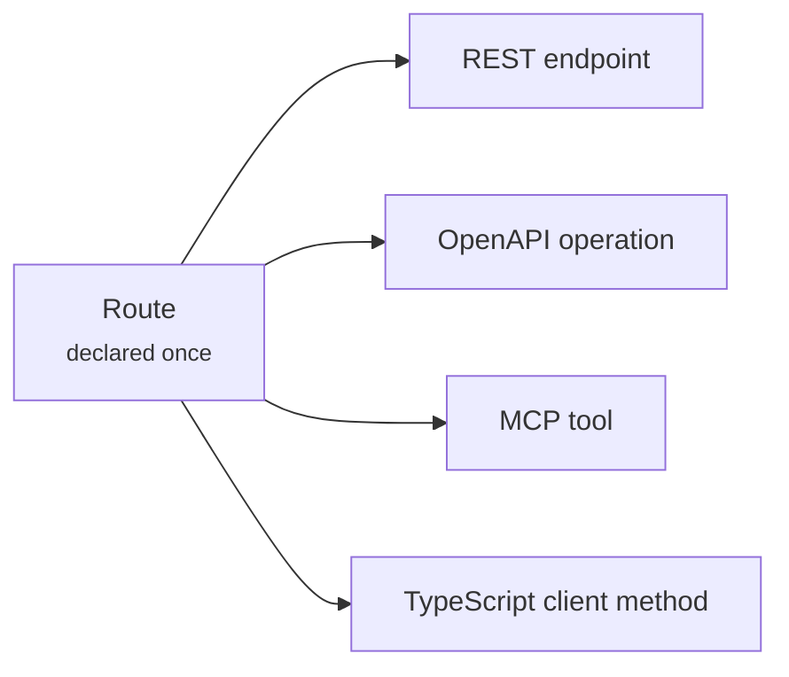

# Tools and MCP

Every framework bolting MCP onto an existing app maintains two descriptions of
the same endpoint: the route, and the tool. They drift.

In WebCortex the route **is** the tool. `tools/list` is a projection of the route
table, and a tool call re-enters the same dispatcher an HTTP request would.

## Exposing a tool

```python
@app.get("/tickets/{id}/summary", tool=True, scopes=["read"])
def summarize(id: int, style: str = "short") -> dict:
    """Summarise a ticket for a human or an agent."""
    return {"id": id, "summary": f"Ticket #{id}"}
```

That produces:

```json
{
  "name": "get_tickets_by_id_summary",
  "description": "Summarise a ticket for a human or an agent.",
  "inputSchema": {
    "type": "object",
    "properties": {
      "id": {"type": "integer"},
      "style": {"type": "string", "default": "short"}
    },
    "required": ["id"],
    "additionalProperties": false
  },
  "annotations": {"readOnlyHint": true, "idempotentHint": true,
                  "requiresApproval": false}
}
```

The schema came from the signature. The description came from the docstring.
Nothing was written twice, so nothing can drift.

## Connecting a client

The MCP endpoint speaks Streamable HTTP JSON-RPC at
`/_webcortex/mcp` and implements `initialize`, `tools/list`, `tools/call`,
`ping`, batching, and notifications.

=== "Claude Desktop / Claude Code"

    ```json
    {
      "mcpServers": {
        "supportdesk": {
          "url": "http://127.0.0.1:8000/_webcortex/mcp",
          "headers": { "x-api-key": "wcx_..." }
        }
      }
    }
    ```

=== "curl"

    ```console
    $ curl -X POST localhost:8000/_webcortex/mcp \
        -H "x-api-key: $WEBCORTEX_API_KEY" \
        -H 'content-type: application/json' \
        -d '{"jsonrpc":"2.0","id":1,"method":"tools/list"}'
    ```

=== "Plain discovery"

    Not every client speaks JSON-RPC. There is a plain listing too:

    ```console
    $ curl localhost:8000/_webcortex/tools -H "x-api-key: $KEY"
    ```

## The tool list is filtered per caller

This is the part most MCP integrations get wrong.

A caller only sees tools their scopes permit. Listing a tool the caller cannot
use invites the model to plan around it and then fail, and it discloses the
shape of your privileged surface.

```console
ADMIN  sees: list_tickets get_tickets create_tickets update_tickets delete_tickets
READER sees: list_tickets get_tickets
```

Calls are enforced with the caller's **own** principal — no scope substitution.
An MCP caller has exactly the authority they would have over plain HTTP.

!!! danger "This was a real vulnerability"
    An earlier version substituted the *route's* declared scopes for the
    caller's when dispatching an MCP tool call. That made every scoped tool
    reachable by any MCP client. It is now a regression test.

## Errors are information, not faults

A failing tool is a successful protocol exchange reporting an error, so the
model can read it and adapt:

```json
{
  "content": [{"type": "text", "text": "tool get_tickets failed with 404: not found"}],
  "isError": true
}
```

A transport-level error would just look like the server broke.

## Approval-gated tools

A tool marked `approval="required"` cannot be invoked directly over MCP at all:

```json
{
  "content": [{"type": "text",
    "text": "tool \"create_tickets_purge\" requires human approval and cannot be invoked directly over MCP"}],
  "isError": true
}
```

Honouring the gate only inside the agent loop would leave an obvious way around
it. See [Agents](agents.md#approval-gates).

## The control plane

Mounted under `/_webcortex` (configurable via `control_prefix`).

| Endpoint | Purpose |
|---|---|
| `GET /health` | Liveness. **Never requires auth** — load balancers cannot present a key |
| `GET /openapi.json` | OpenAPI 3.1 document |
| `GET /tools` | Plain tool listing |
| `GET /routes` | Route table with the engine serving each |
| `GET /agents` | Declared agents, their tools and budgets |
| `GET /audit` | Recent agent activity |
| `GET /security` | Public attack surface |
| `POST /mcp` | MCP JSON-RPC |

!!! warning "The control plane needs `webcortex:admin`"
    Once any authentication is configured, everything except `/health` requires
    the `webcortex:admin` scope. An open MCP endpoint hands an attacker every
    tool in your application.

## One declaration, four consumers



Add a route and all four update. There is no second artifact to forget.

[Agents :material-arrow-right:](agents.md){ .md-button .md-button--primary }
