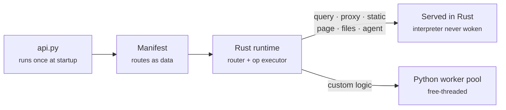

# How it works

Understanding one idea makes the rest of the framework predictable.

## Python declares; Rust executes

A WebCortex app is a **description**, not a server.



Importing your `api.py` builds a manifest — a plain data structure describing
every route. The Rust runtime compiles that into a router and a set of
executable operations. Your Python code has finished running before the first
request arrives.

The consequence: a route whose work is expressible as data never re-enters the
interpreter. Only routes with genuine custom logic cross the bridge.

```console
$ webcortex check
  12 routes, 11 served without touching Python
```

!!! tip "Why this is the interesting boundary"
    Most Rust-accelerated Python servers (Granian, Robyn) put Rust at the socket
    and call Python once per request. Faster parsing, same interpreted handler —
    roughly a 2x win, not a category change.

    Moving the boundary to *build time* means whole classes of route leave the
    interpreter entirely. Most of a CRUD API is exactly that kind of route.

## The nine route kinds

| Kind | Declared with | Runs in | Typical cost |
|---|---|---|---|
| Static | `app.static(...)` | Rust | serialised once at boot |
| Query | `app.query(...)`, `app.resource(...)`, `app.memory(...)` | Rust | SQL + JSON encode |
| Page | `app.page(...)` | Rust | SQL + template render |
| Files | `app.static_files(...)` | Rust | disk read + etag |
| Proxy | `app.proxy(...)` | Rust | one upstream hop |
| Agent | `app.agent(...)` | Rust | model latency |
| Flow | `app.flow(...)` | Rust | the steps it runs |
| Behaviour | `@app.behaviour(...)` | Python worker pool | interpreter + leaves |
| Python | `@app.get(...)` | Python worker pool | interpreter |

Measured throughput on an M-series machine, 24 concurrent clients:

| Route kind | req/s | p50 | p99 |
|---|---:|---:|---:|
| Static (Rust) | 29,287 | 0.69 ms | 2.66 ms |
| Query (Rust + SQLite) | 22,317 | 0.92 ms | 2.88 ms |
| Page (Rust + minijinja) | 21,869 | 0.95 ms | 2.98 ms |
| Static files (Rust) | 21,633 | 0.91 ms | 4.31 ms |
| Python handler | 8,675 | 2.51 ms | 7.02 ms |

!!! note "Read these as floors"
    The load generator was stdlib Python and is likely the ceiling on the
    ~21–29k rows. The defensible claim is the *ratio*: native routes sustain
    roughly 2.5x the throughput of the Python bridge path. A proper benchmark
    against Django or FastAPI has not been run and is not claimed.

## The request path

Order is fixed deliberately:

1. **CORS preflight** — answered before anything can reject it
2. **Request ID** — assigned, so every later log line correlates
3. **Rate limit** — the cheapest rejection, before authentication work
4. **Authenticate** — the principal is established exactly once
5. **Dispatch** — scope checks happen next to the op
6. **Response headers** — security headers and CORS on every exit path

Steps 1–4 apply to the control plane too. An unauthenticated MCP endpoint would
hand an attacker every tool in the application.

A panic anywhere in this path is caught and becomes a 500 for that one request,
never a severed connection.

## Identity flows in one direction

A **principal** is established at the edge and carried unchanged. Every consumer
— an HTTP route, an MCP tool call, an agent step, a Behaviour — reads the same
one. There is no second authentication path.

When an agent, Behaviour or flow runs, it executes as a *delegate*:

```python
actor = caller.delegate_to_agent(name, declared_scopes)
```

Delegated scopes are the **intersection** of what the agent declares and what
the caller holds — never the union. An agent declaring `["read", "write"]`,
started by a caller holding only `["read"]`, gets `["read"]`. A supervisor's
worker is delegated from the supervisor; a handoff target is delegated from
the original caller and filtered by what the previous agent held. Authority
only ever shrinks.

This is the confused-deputy defence, and it is enforced in code rather than left
to the application author to remember. The *root* of the chain — the human or
service that started things — stays reachable as `@principal`, so memory and
scoped queries belong to that caller however deep the call is.

## The Python worker pool

When a route does need Python, the runtime hands it to a pool sized from your
CPU count.

- **Async handlers** (`async def`) go to one of N worker threads, each running
  its own asyncio event loop.
- **Sync handlers** go to a thread pool, so a blocking call can never stall an
  event loop that other requests are sharing.

On a free-threaded interpreter those loops execute in genuine parallel. On a GIL
build the same code is still correct — it overlaps on I/O and serialises on CPU.

```python
@app.get("/slow")
async def slow() -> dict:
    import asyncio, threading
    await asyncio.sleep(0.05)
    return {"thread": threading.current_thread().name}   # webcortex-loop-3
```

## Nesting is bounded

Behaviours and agents can call tools, and those tools can reach other Behaviours
— so the call graph is genuinely cyclic. Every in-process invocation carries a
`depth`, checked against `max_invocation_depth` (default 8).

Exceeding it returns **508 Loop Detected**, surfaced as a clean halt.

A second thing travels with the request: the **shared budget**. The outermost
agent, behaviour or flow creates it from its `token_budget`, and every nested
run charges the same counter, so a tree of agents spends against one ceiling
rather than one per frame.


!!! danger "This was a real bug"
    Before the depth counter existed, each nested invocation received a *fresh*
    step budget, so `max_steps` never bounded the total — and every level held a
    worker thread while waiting. A self-recursive Behaviour could permanently
    exhaust the pool: measured at **0 of 60** subsequent requests completing,
    against 60 of 60 without it.

    The generalisable lesson: a per-frame limit is not a per-request limit. The
    counter has to travel with the request.

## Fail at boot, not at 3am

Cross-references the type system cannot catch are validated when the app is
built, not when a request arrives:

- a proxy pointing at an undeclared upstream
- an agent referencing a tool that is not an exposed route (with a "did you
  mean?" suggestion)
- two routes claiming the same tool name
- an approval gate on a route no agent can call
- a query route with no database configured
- a page whose template does not parse
- CORS with `*` origins *and* credentials, which browsers reject anyway

```console
$ webcortex check
webcortex: invalid application: agent "librarian" references tool "list_book",
which is not an exposed route. Did you mean "list_books"?
```

[Routing :material-arrow-right:](routing.md){ .md-button .md-button--primary }
