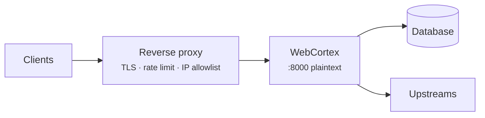

# Deployment

## Is it production ready?

An honest answer, because the useful version is qualified.

<div class="grid cards" markdown>

- :material-check-circle:{ .lg } **Yes, for**

    ---

    Internal tools and dashboards · services behind a trusted network ·
    API-key clients · MCP servers for your own agents · anything where you
    control every caller

- :material-alert:{ .lg } **Not yet, for**

    ---

    Public authenticated browser apps (no CSRF or cookie sessions) ·
    write-heavy Postgres workloads (SQLite only) · agent runs that must
    survive a restart · anything needing token-level streaming

</div>

**What is verified:** 326 tests, an adversarial security review with six fixes,
1.79M requests soaked with zero errors and stable memory, wheels building on
five platform targets across four interpreter versions.

**What is young:** v2.0.0, one author, a few thousand installs and no known
production users yet.

---

## Architecture



WebCortex serves **plaintext HTTP** and expects TLS to terminate in front of it.
That is a deliberate scope decision, not an oversight — certificate lifecycle
belongs in infrastructure you already operate.

---

## Configuration

Everything overridable by environment, so one image runs everywhere:

| Variable | Purpose |
|---|---|
| `WEBCORTEX_HOST` | Bind address (use `0.0.0.0` in a container) |
| `WEBCORTEX_PORT` | Bind port |
| `WEBCORTEX_DATABASE_URL` | Overrides the declared database |
| `WEBCORTEX_LOG` | `error` / `warn` / `info` / `debug` |
| `WEBCORTEX_DEBUG_ERRORS` | **Never set in production** — returns tracebacks |
| `ANTHROPIC_API_KEY` | For `claude-*` and `anthropic/…` models; `ANTHROPIC_BASE_URL` for a gateway |
| `OPENAI_API_KEY` | For `gpt-*` and `openai/…` models; `OPENAI_BASE_URL` for a gateway |
| `OLLAMA_HOST` | Where `ollama/…` models are served (default `http://127.0.0.1:11434`) |
| `WEBCORTEX_FAKE_PROVIDER` | **Tests only** — answers every model call deterministically |

Plus every `env_var` you named in `app.api_key(...)` and `app.jwt(...)`.

```python
app = WebCortex(
    "myapp",
    host="0.0.0.0",
    port=8000,
    workers=None,          # defaults to CPU count on free-threaded builds
    request_timeout=30,
    shutdown_timeout=25,
)
```

---

## Docker

There is no build stage: `pip install` pulls a prebuilt wheel, so the image
needs no Rust toolchain and no compiler.

```dockerfile title="Dockerfile"
# 3.12–3.14, or 3.14t for free-threading.
FROM python:3.13-slim

RUN useradd --create-home --uid 10001 app
WORKDIR /app
RUN pip install --no-cache-dir web-cortex-framework
COPY --chown=app:app . .
USER app

ENV WEBCORTEX_HOST=0.0.0.0 WEBCORTEX_PORT=8000 WEBCORTEX_LOG=info
EXPOSE 8000

HEALTHCHECK --interval=30s --timeout=3s --start-period=10s \
  CMD python -c "import urllib.request;urllib.request.urlopen('http://127.0.0.1:8000/_webcortex/health')"

CMD ["webcortex", "run", "api.py"]
```

!!! tip "Pin the version"
    `pip install web-cortex-framework==2.0.0` in an image you intend to
    redeploy. The wheel is prebuilt for Linux x86_64 and aarch64, so the install
    is a download, not a compile.

```yaml title="docker-compose.yml"
services:
  api:
    build: .
    ports: ["8000:8000"]
    environment:
      WEBCORTEX_API_KEY: ${WEBCORTEX_API_KEY:?required}
      WEBCORTEX_DATABASE_URL: sqlite:///data/app.db
    volumes: ["appdata:/data"]
    restart: unless-stopped
volumes: { appdata: }
```

---

## Reverse proxy

=== "Caddy"

    ```caddyfile
    api.example.com {
        reverse_proxy localhost:8000
    }
    ```

    Automatic TLS, and it forwards `X-Forwarded-*` by default.

=== "nginx"

    ```nginx
    server {
        listen 443 ssl http2;
        server_name api.example.com;
        ssl_certificate     /etc/letsencrypt/live/api.example.com/fullchain.pem;
        ssl_certificate_key /etc/letsencrypt/live/api.example.com/privkey.pem;

        location / {
            proxy_pass http://127.0.0.1:8000;
            proxy_set_header Host              $host;
            proxy_set_header X-Real-IP         $remote_addr;
            proxy_set_header X-Forwarded-For   $proxy_add_x_forwarded_for;
            proxy_set_header X-Forwarded-Proto $scheme;
            proxy_read_timeout 60s;
        }
    }
    ```

!!! warning "Rate limit at the edge too"
    WebCortex does **not** trust `X-Forwarded-For` — it is client-controlled, and
    trusting it hands an attacker unlimited bucket rotation. The consequence is
    that behind a proxy, every anonymous caller shares one bucket.

    Until trusted-proxy configuration lands, apply per-IP limiting at your proxy
    and treat the WebCortex limiter as a per-principal backstop.

---

## Health and graceful shutdown

`GET /_webcortex/health` never requires authentication — a load balancer cannot
present an API key.

```json
{"status": "ok", "app": "myapp", "version": "0.1.0",
 "routes": 12, "tools": 8, "agents": 1, "behaviours": 1, "flows": 0,
 "python_workers": 10, "sessions": 3, "pending_approvals": 0}
```

On `SIGTERM` or `SIGINT`, the server stops accepting connections and drains
in-flight requests for up to `shutdown_timeout` seconds. A deploy never severs a
request that was mid-flight.

Set your orchestrator's grace period **above** `shutdown_timeout`:

```yaml
terminationGracePeriodSeconds: 40   # shutdown_timeout is 25
```

---

## Observability

Structured logs on stdout, one line per request:

```
INFO request request_id=35f39176-… method=GET path=/tickets status=200
     principal=service elapsed_us=412
```

An inbound `X-Request-ID` is echoed and used throughout; otherwise one is
generated. Every response carries it.

Agent activity goes to the `webcortex::audit` target and to
`GET /_webcortex/audit`:

```
INFO audit kind=tool_called run_id=… actor=agent:assistant#service
     tool=list_tickets detail={"ok":true,"duration_ms":3}
```

---

## Sizing

- **Native routes** are Rust and scale with cores. A single instance sustains
  20,000+ req/s on a laptop.
- **Python routes** are bounded by the worker pool. On a free-threaded build
  that is real parallelism; on a GIL build it is not.
- **Memory** reaches steady state around 280 MB under sustained mixed load and
  stays there. Measured over 1.79M requests.
- **SQLite writes serialise.** For write-heavy work, wait for Postgres or use a
  Python handler against a real connection pool.

Prefer horizontal scaling, with one caveat. Instances are stateless apart from
the database *and* agent state: sessions and suspended approvals live in the
memory of the instance that created them. Route a session's requests, and the
`POST /_webcortex/approvals/{id}` that resumes a run, back to that instance
(sticky routing), or run one instance while you rely on them.

---

## Pre-flight checklist

- [ ] `webcortex security` reviewed; `public_routes` is exactly what you intend
- [ ] TLS terminating in front
- [ ] `WEBCORTEX_DEBUG_ERRORS` unset
- [ ] Secrets injected from a secret manager, not baked into the image
- [ ] Health check wired to `/_webcortex/health`
- [ ] Grace period longer than `shutdown_timeout`
- [ ] Rate limiting at the edge as well as in-process
- [ ] Log aggregation capturing `webcortex::audit`
- [ ] Every agent, behaviour and flow has a `token_budget`; prices declared so `/usage` reports dollars
- [ ] Sessions and pending approvals expiring after an hour suits the workload (`session_ttl_secs` and `approval_ttl_secs` are fixed defaults, not yet settable from Python)

- [ ] Database backups, if SQLite: the file is your database
- [ ] `cargo audit` in CI

[Use cases :material-arrow-right:](use-cases.md){ .md-button .md-button--primary }
